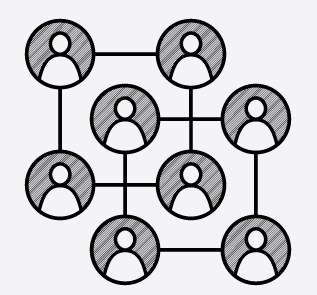

# Distributed Architectures for Cloud

<div align="center">
    
</a>

##### Author: Giuseppe Di Palma

## Project Assignment

md5(giuseppedipalma-31) = **8**185eaebad44a09266a9c2a66878bc46

***Value 5 = Project number 5 🤦‍♂️***

</div>

## Project Description

### Semantic Harmony Social Network

Design and develop a social network based on the user’s interests that exploits a P2P Network. The system collects the profiles of the users and automatically creates friendships according to a matching strategy. The users can see their friends over time and are automatically informed when a user enters the social network and becomes a new potential friend. The system defines a set of questions, for instance, if the user like or not like a set of photos, a set of a hashtag, or more accurate as Big Five Personality Test.

At this point, the system can compute the user scoring according to the answers. This scoring is elaborated by a matching strategy that automatically finds out the friends. Consider, for instance, a binary answers vector; a matching process should be the difference in 0 and 1, or the Hamming distance, and so on. The system allows the users to see the social network questions, create a profile score according to the answer, join in the network using a nickname, and eventually see all user friends. As described in the [SemanticHarmonySocialNetwork](https://github.com/spagnuolocarmine/distributedsystems_class_2020/blob/master/homework/SemanticHarmonySocialNetwork.java) Java API.

#### Proposed solution

My personal solution has been developed on the basis of the indications given above. The first time you log on to the social network you are asked a series of questions(10) which you can answer with a grade from 1 (little agree) to 5 (very agree). At the end we will have a personal sequence of answers for each user.

Later this sequence was expanded with a random string of 5 characters (just to increase the randomness).
As soon as users become two or more, a check is made to see if two people have the same interests.

This calculation is done using the algorithm [LCS(longest common subsequence)](https://en.wikipedia.org/wiki/Longest_common_subsequence_problem).
If the LCS distance value is <= 5 then there is friendship

This solution provides for the following actions:

- Join the network;
- Search for users;
- Associate people with the same interests;
- Exit the network.

#### Solution structure

- `public List<String> getUserProfileQuestions()`:
- `public String createAuserProfileKey(List<Integer> _answer)`:
- `public boolean join(String _profile_key, String _nick_name)`:
- `public List<String> getFriends()`:

##### Specific functions

- `public static String generateRandomString()`:
- `static int LCSDistance(String X, String Y)`:

#### JUnit tests

- `void checkFillAnserList()`:
- `void checkNewAnswer()`:
- `void checkFriendship()`:
- `void checkSendNotification()`:
- `void checkJoinInNetwork()`:
- `void checkPeerObj()`:
- `void checkExitFromNetwork()`:
- `void checkRetriveUserFromSearch()`:

### Usage

```bash
docker build --no-cache -t socialnetworkp2p .
```

Run master-peer:

```bash
docker run -i --name MASTER-PEER -e MASTERIP="127.0.0.1" -e ID=0 socialnetworkp2p
```

Take CONTAINER ID:

```bash
docker ps
```

Take ADDRESS-IP of container:

```bash
docker inspect <MASTER PEER ID>
```

Start other peer:

```bash
docker run -i --name PEER-1 -e MASTERIP="172.17.0.2" -e ID=1 socialnetworkp2p
docker run -i --name PEER-2 -e MASTERIP="172.17.0.2" -e ID=2 socialnetworkp2p
docker run -i --name PEER-3 -e MASTERIP="172.17.0.2" -e ID=3 socialnetworkp2p
```

#### Build with

- Maven: **4.0.0**
- Java: **14.0**
- TomP2P: **5.0-Beta8**
- Docker: **20.10.12** on WSL2
